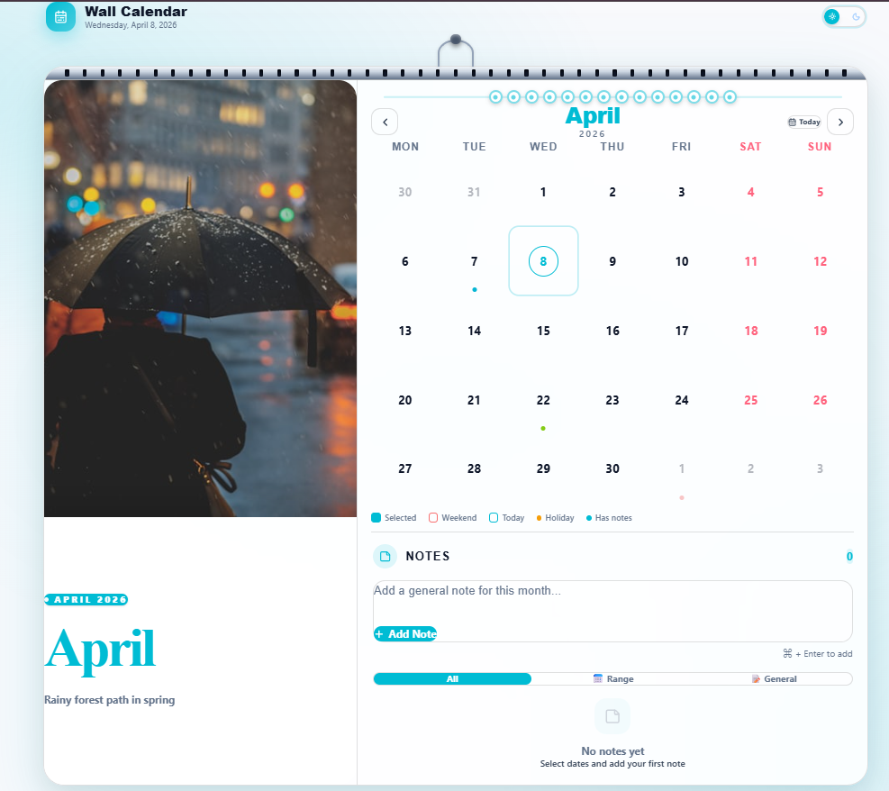
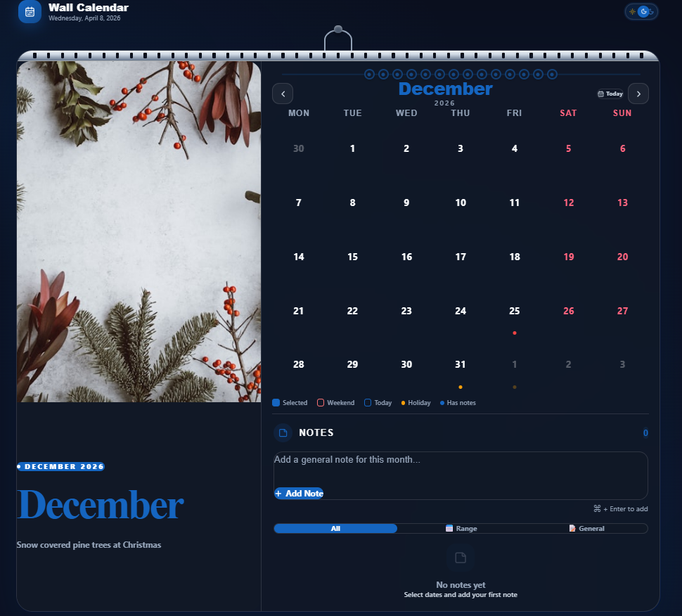
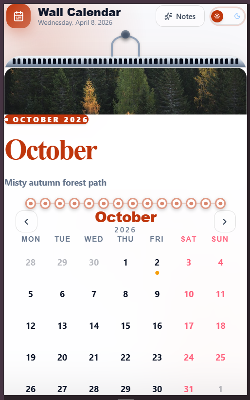

# 🎨 Premium Interactive Wall Calendar

A visually stunning, production-quality **interactive wall calendar component** built using modern frontend technologies. Designed to combine **aesthetic appeal, smooth interactions, and functional usability** — inspired by real-world product UI standards.

---

## ✨ Features

### 🗓️ Wall Calendar Aesthetic

* Realistic hanging calendar design with **spiral binding effect**
* Clean split-view layout with **hero image + calendar grid**
* Carefully crafted visual hierarchy

### 🎨 Dynamic Theme Adaptation

* Automatically extracts dominant colors from the hero image
* Applies theme dynamically across the UI
* Creates a cohesive, immersive visual experience

### 📆 Interactive Calendar Grid

* Full month navigation with smooth transitions
* Highlights:

  * Today
  * Weekends
  * Holidays
* Clean and responsive grid layout

### 🔄 Date Range Selection

* Select start and end dates intuitively
* Visual feedback for:

  * Start date
  * End date
  * Range in between
* Smooth animated transitions using Framer Motion

### 📝 Integrated Notes System

* Add notes for:

  * Entire month
  * Selected date range
* Persistent storage using `localStorage`
* Visual indicators for dates with notes

### 🌗 Dark / Light Mode

* Seamless theme switching
* Maintains consistent design system across modes

### 📱 Fully Responsive Design

* Desktop → Split layout (image + calendar)
* Mobile → Stacked layout with touch-friendly interactions
* Optimized spacing and usability across devices

---

## 🧰 Tech Stack

* **Build Tool:** Vite
* **Framework:** React
* **Language:** JavaScript (ES6+)
* **Styling:** Tailwind CSS + CSS Variables
* **Animations:** Framer Motion
* **Date Handling:** date-fns
* **Color Extraction:** Canvas API (custom hook)
* **Icons:** Lucide React

---

## 🧠 Architecture Highlights

* Modular component structure (`Calendar`, `Notes`, `UI`)
* Custom hooks:

  * `useCalendar`
  * `useNotes`
  * `useColorExtract`
* Clean separation of concerns
* Scalable folder structure for production-level apps

---

## 🚀 Running Locally

```bash
npm install
npm run dev
```

Then open:
👉 http://localhost:5173

---

## 🎥 Demo Video

👉 https://drive.google.com/file/d/1XSYspmTfDl2EY1CbyT4jeSiAmYFjZFzy/view?usp=sharing

## 🌐 Live Demo
👉 https://interactive-wall-calendar-chi.vercel.app

---

## 📸 Screenshots

### 🌞 Light Mode


### 🌙 Dark Mode


### 📱 Mobile View



---

## ⚙️ Design & UX Focus

This project emphasizes:

* Micro-interactions and smooth animations
* Responsive and accessible UI
* Real-world product design inspiration
* Clean and maintainable code architecture

---

## ⚠️ Notes & Trade-offs

* **Frontend-only implementation:**
  No backend or database (as per requirements)

* **Data persistence:**
  Uses browser `localStorage`

* **Image Handling:**
  Unsplash images with Canvas-based color extraction
  (`Cross-Origin-Opener-Policy` enabled)

---

## 💡 Future Improvements

* Drag & drop events
* Calendar syncing (Google Calendar)
* Multi-user collaboration
* Offline support (PWA)

---

## 🙌 Author

Built with a focus on **modern frontend engineering, UI/UX excellence, and real-world scalability**.

---
